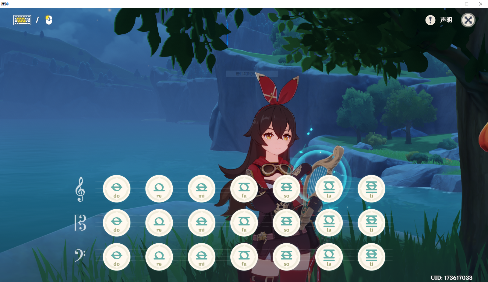
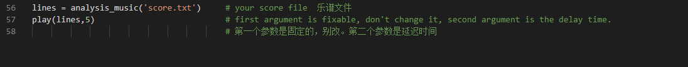

# Genshin impact piano automatic script



Write your own score and run the python code in powershell or CMD with administrator power.

If you score don't named score.txt, please change the parameter of function analysis_music in line 56.



score file format:

```
note_1#note_2#...#note_n
sleep_time
note_1#note_2#...#note_n
sleep_time
....
note_1#note_2#...#note_n
```

notes:

```
'do_h'
'do_m'
'do_l'
're_h'
're_m'
're_l'
'mi_h'
'mi_m'
'mi_l'
'fa_h'
'fa_m'
'fa_l'
'so_h'
'so_m'
'so_l'
'la_h'
'la_m'
'la_l'
'ti_h'
'ti_m'
'ti_l'
```

_l means low pitch, _m means medium pitch, _h means high pitch.

example:

It is the first sentence of "Little Star"

```
do_m#do_l
0.5
do_m#do_l
0.5
so_m#so_l
0.5
so_m#so_l
0.5
la_m#la_l
0.5
la_m#la_l
0.5
so_m#so_l
1
fa_m#fa_l
0.5
fa_m#fa_l
0.5
mi_m#mi_l
0.5
mi_m#mi_l
0.5
re_m#re_l
0.5
re_m#re_l
0.5
do_m#do_l
```
dependency:
```
pip install pyaudiogui
```